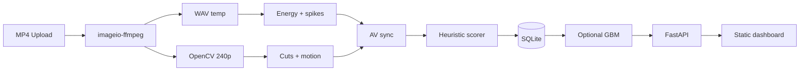

# EditIQ Architecture

EditIQ is a local full-stack tool that extracts audiovisual features from short-form edits, scores viral potential with heuristics, persists results in SQLite, and supports optional scikit-learn training.

## Pipeline

## Processing parameters

| Parameter | Value | Purpose |
|-----------|-------|---------|
| `PROCESS_HEIGHT` | 240px | Fast frame analysis |
| `FRAME_SKIP` | 2 | Process every 2nd frame |
| `HIST_CUT_THRESHOLD` | 0.35 | HSV histogram cut detection |
| `AUDIO_FRAME_MS` | 100 | RMS energy windows |
| `AV_SYNC_TOLERANCE_S` | 0.15 | Cut–beat alignment window |

## Feature definitions

### Video

- **cuts_count / cuts_per_second** — Scene changes from consecutive-frame HSV histogram correlation drops.
- **avg_scene_duration** — `duration / (cuts + 1)`.
- **motion_intensity** — Mean normalized pixel diff between downscaled grayscale frames.
- **visual_change_rate** — Mean histogram difference across frames.
- **visual_stability** — `1 - min(1, std(motion))`.
- **hook_speed** — Time of first cut, or first high-motion frame.

### Audio

- **audio_energy** — Mean 100ms RMS (normalized waveform).
- **audio_spikes_count** — Peaks above rolling mean × 1.4 + 0.02.
- **audio_pacing** — Spikes per second of audio.

### Cross-modal

- **av_sync_score** — Fraction of cuts with a spike within 150ms.

## Heuristic weights (viral score)

| Component | Weight |
|-----------|--------|
| Hook | 30% |
| Pacing | 25% |
| Motion | 25% |
| AV sync (×100) | 20% |

### Hook score

- Penalizes first cut after 2s; rewards cuts under 1s.
- Blends 65% hook timing + 35% early motion proxy.

### Pacing score

- Optimal band: **1.0–2.5 cuts/sec** (typical TikTok edit pacing).

### Retention risk

- Increases with avg scene duration > 4s, low cuts/sec, low motion.

## Storage

- Database: `data/editiq.db`
- Uploaded videos are processed in a temp directory and **not** retained on disk.
- Timeline JSON (motion + audio curves, cut times) stored for chart replay.

## API

| Method | Path | Description |
|--------|------|-------------|
| POST | `/api/analyze` | Upload + analyze |
| GET | `/api/history` | List analyses |
| GET | `/api/analysis/{id}` | Full report |
| POST | `/api/train` | Train GradientBoosting model |
| GET | `/api/model-status` | Model metadata |
